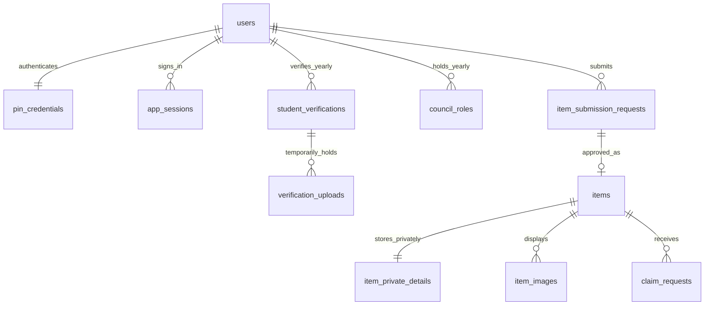
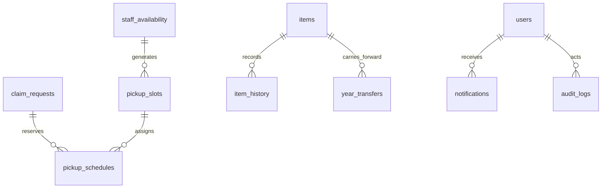

# 운영 수정본 구조

기존 화면 → Next.js 서버 API → Supabase PostgreSQL·비공개 Storage.

학생 로그인은 이름·학번·6자리 PIN을 사용하며, PIN 해시·opaque 세션을 별도 테이블에서 관리합니다. 브라우저는 DB에 직접 접속하지 않습니다. 서버 세션으로 확인한 actor만 SQL 함수에 넘깁니다.

## 읽기/쓰기 경계

- `/api/state`: 현재 사용자·현재 학년도 기준으로 허용된 데이터만 조회. 학생증·다른 학생 요청·내부 번호는 일반 목록에 없음.
- `/api/auth`: 가입, 로그인, 로그아웃, 새 학년도 재인증. PIN 원문은 해시 계산 외에 저장/출력하지 않음.
- `/api/action`: Origin 검사 → 세션 확인 → 요청 제한 → 역할/소유권/현재 학년도를 SQL에서 검증 → 트랜잭션.
- `/api/image`: 학생증·접수 사진·공개 승인 사진·본인 담당 물품을 각각 권한 검사 후 스트리밍. no-store.
- `/api/maintenance`: 별도 스케줄러와 비밀 토큰으로만 실행.

## 권한

| 권한 | 범위 |
|---|---|
| STUDENT | 본인 인증·등록·수령·예약·알림 |
| COUNCIL_MEMBER | 지정된 전달 권한이 있을 때 자신의 일정·배정 |
| WELFARE_MANAGER | 분실물 운영·직접 등록·전달 임원 지정, 부장(is_head)만 학생증 확인 |
| PRESIDENT_TEAM | 분실물 운영·학생증 확인·전달 임원/복지부 역할 관리 |
| SUPER_ADMIN | 운영·권한·학년도 관리. 학생증 확인 권한은 포함하지 않음 |

최초 관리자도 일반 가입 화면에서 계정과 인증 요청을 만든 뒤, 학교 담당자가 서버 전용 bootstrap으로 신원을 확인해 활성화합니다. 일반 관리자 후보는 비공개 admin_allowlist와 일치하는 학생증 승인이 있을 때만 role을 받습니다. 상세 예외·권한 범위는 README의 v0.3 절차를 따릅니다.

## 주요 관계

## 동시 처리와 데이터 보호

예약은 승인 요청을 잠근 뒤 가능한 슬롯을 `FOR UPDATE SKIP LOCKED`로 선택합니다. 슬롯·승인 요청의 활성 예약 unique index가 중복을 막습니다. 가능 시간 중복은 임원별 advisory lock과 겹침 검사로 차단합니다.

반환/미수령/취소는 예약·요청을 잠그고 원자적으로 처리합니다. 반환 완료 후 코드 해시와 암호문을 모두 제거합니다. 처리한 예약 재전송은 상태 검사로 거절합니다.

학생증은 DB와 Storage의 원자적 삭제가 불가능하므로 삭제 대기 → Storage 삭제 → 성공 기록 순서로 처리합니다. 실패 상태를 감추지 않고 재시도합니다. 완료 사진은 미삭제 상태여도 열람 API에서 차단됩니다. orphan 업로드에도 만료를 둡니다.

모든 앱 테이블은 RLS 활성화 및 공개 역할 권한 회수. 서버 전용 함수 역시 anon/authenticated 실행 권한이 없습니다. Service Role은 서버 전용이므로 SQL 권한 검사와 세션 검증을 함께 유지해야 합니다.

## 상태

실물 전달 대기 → 등록 확인 중 → 보관 중 → 본인 확인 중 → 예약 가능 → 예약 완료 → 수령 완료.

NO_SHOW는 예약 이력에 남고 물품은 예약 가능 상태로 돌아갑니다. 반려·추가 확인은 각 요청의 상태로 관리합니다. 장기 미수령은 14일 조건의 표시이며 폐기/삭제 상태가 아닙니다.

## 보존/연도

현재 관리 연도와 최초 등록 연도를 구분합니다. 학년도 전환은 실사·미처리 요청 정리 후 수행하며 이전 역할·세션은 만료됩니다. 학교 운영 담당자가 새 첫 관리자/인증 담당자를 지정한 다음 일반 학생 재인증을 시작합니다. 과거 데이터는 지우지 않습니다.

현재 Supabase 계정 연결·운영 DB/Storage 검증·주기 스케줄은 미설정입니다. 공개 URL은 동일 UI의 운영 준비 화면만 제공합니다. 테스트 결과의 범위는 VALIDATION.md를 확인하세요.

권한 변경과 관리자 후보 승인은 학년도 단위 advisory lock으로 직렬화합니다. 활성화는 인증 상태 변경 트리거에서 실행하며 유효한 학생증 업로드와 승인자·승인 시각을 확인합니다. 역할 변경은 이전 행을 revoke하고 새 행을 추가합니다. 관리자 직접 등록은 기존 접수·실물 확인·공개 로직을 하나의 트랜잭션 안에서 호출하므로 일부 데이터만 커밋되지 않습니다.

## v0.4 연결 설정

server-only DB 모듈이 NEXT_PUBLIC_SUPABASE_URL과 SUPABASE_SECRET_KEY를 읽습니다. Publishable Key는 읽기 전용 연결 점검에서 일반 접근 차단을 검사합니다. 프론트엔드에 서비스 키나 DB 직접 CRUD를 추가하지 않습니다. `yg_connection_health`가 migration 버전·25개 테이블 RLS·private bucket·학년도를 확인한 뒤 state를 connected로 표시합니다. 불완전한 설정에서는 가입/변경 API도 503으로 거부합니다. 명시적인 restrictive RLS 정책은 anon/authenticated의 모든 직접 앱 데이터 접근을 거부합니다.
