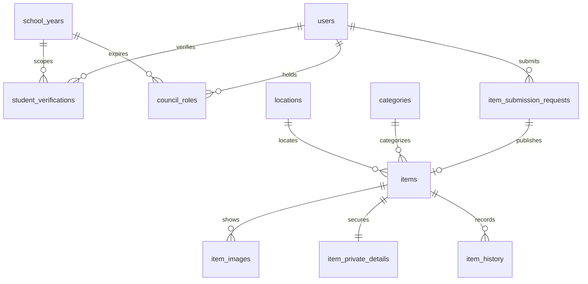
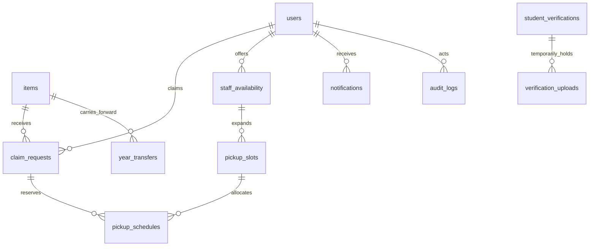

# 양고 찾기 — Phase 0 설계서

2026-09-17 · 구현 범위: Phase 1 UI 프로토타입. 이 문서에서 ‘운영 설계’라고 적힌 기능은 실제 서비스에 아직 연결되지 않았다.

## 1. 전체 시스템 구조

Next.js App Router + TypeScript + Tailwind CSS → 서버 액션/Route Handler → Supabase Auth, PostgreSQL, 비공개 Storage. Vercel이 Next.js 앱을 실행한다. 첫 단계는 React 메모리 상태로 업무 흐름을 검증하며, 브라우저 새로고침 시 예시 데이터로 돌아간다.

운영 시 `lib/model.ts`의 시연 reducer는 제거하고, 서버 API를 호출하는 데이터 접근 계층으로 교체한다. 클라이언트에 관리자 비밀 데이터와 전체 학생 목록을 내려보내지 않는다. 화면 숨김은 보안이 아니다. 현재 역할 선택기는 시연 전용이며 배포 전 제거해야 한다.

## 2. 사용자와 권한 — 운영 설계

| 사용자 | 허용 범위 | 금지 범위 |
|---|---|---|
| 비로그인·인증 대기 | 로그인, 자신의 인증 상태, 재제출 | 학교 분실물 데이터·수령 요청·임원 기능 |
| STUDENT | 현재 학년도 목록·본인 요청·승인된 본인 예약 | 타인의 요청·학생증·보관번호·관리 로그 |
| COUNCIL_MEMBER | 지정된 전달 권한이 있을 때 자신의 가능 시간과 배정된 전달 정보 | 재학생 승인·소유 승인·타 임원 개인 일정 |
| WELFARE_MANAGER | 가입 확인·실물 확인·등록 및 수령 승인·배정·반환·운영 기록 | 최고 관리자 변경 |
| PRESIDENT_TEAM | 복지부와 같은 운영 권한·인수인계 검토 | 최고 관리자 변경 |
| SUPER_ADMIN | 최초 운영 설정·학년도 전환·임원 권한 부여 및 회수 | 감사 기록 삭제·임의의 자기 승인 우회 |

모든 권한 판단은 서버가 현재 학년도·VERIFIED·역할 유효기간·revoked_at을 확인한다. 계정의 UUID는 영구 식별자이고, 학번은 학년도별 속성이다. 최고 관리자 복구는 학교가 관리하는 운영 계정으로 별도 절차를 둔다. 학생회 연간 권한과 학교 운영 책임자의 복구 권한은 혼동하지 않는다.

## 3. 학생과 관리자의 이용 흐름

학생이 사진과 발견 정보를 제출 → 안전생활부실에 실물 전달 → 복지부가 실물 확인 → 내부 보관번호 입력 후 승인 → 본관 중앙 현관 잠금형 분실물함에 보관.

주인이 공개 목록 검색 → 공개되지 않은 특징을 비공개로 제출 → 복지부의 소유 확인 → 승인 후 수령번호 발급 → 임원 이름을 숨긴 가용 슬롯에서 시간 선택 → 예약된 담당자만 안내 → 약속 장소에서 번호 및 본인 확인 → 실제 전달 직후 담당 임원이 반환 완료.

반환 기록과 알림은 같은 업무 트랜잭션에 묶는다. 알림 전달 장애가 실제 반환을 되돌리거나 중복 처리하지 않도록 outbox를 사용한다.

## 4. 페이지 구조

| 경로 | 용도 | Phase 1 |
|---|---|---|
| `/` | 검색·최근 물품·실물 전달 안내 | 구현 |
| `/items` | 검색·카테고리·날짜·장소·상태 필터 | 구현 |
| `/items/[id]` | 상세·소유 확인 요청 | 시연 구현 |
| `/submit` | 물품 사진·발견 정보 입력 | 시연 구현, 메모리 보관 |
| `/login` | 인증 안내와 시연 로그인 | 실제 개인정보 입력 금지 |
| `/my` | 내 등록·수령·예약·완료 내역 | 시연 구현 |
| `/notifications` | 알림과 읽음 상태 | 시연 구현, 단일 공용 예시 알림함 |
| `/admin` | 등록·소유 확인·반환·연도·로그 | 시연 구현 |
| `/staff` | 임원 가능 시간 등록 | 시연 구현 |
| `/admin/verifications` | 가입 승인·거절·학생증 열람 | Phase 3 |
| `/admin/years/[year]` | 연도별 통계·인계명세 | Phase 9 |

## 5. 데이터베이스 ERD

### 테이블 설계 보충

- `users`: auth.users UUID를 참조하는 기본 프로필. 이름은 인증 때 검수한다. 이메일/로그인 정보는 Supabase Auth가 관리하고 공개하지 않는다.
- `student_verifications`: 학년도별 신청·승인 이력, 학번, 검수 관리자·시간. 중복 VERIFIED 학번을 동일 학년도에서 금지한다. 재신청은 기존 거절 이력을 보존하는 새 요청으로 만든다.
- `verification_uploads`: 학생증 경로·만료일·삭제 작업 상태만 기록한다. 이미지 바이트를 DB에 저장하지 않는다.
- `council_roles`: 학년도·역할·유효기간·회수 상태·전달 권한. 일반 학생은 역할 행을 직접 만들 수 없다.
- `item_submission_requests`: 실제 접수 전 요청. 접수 여부·중복·거절·수정 이력. 공개 설명과 관리자만 보는 식별 단서를 분리한다.
- `items`: 공개 가능한 물품 정보·최초 학년도·현재 관리 학년도·상태. 실제 접수 확인된 요청만 서버 트랜잭션에서 생성한다.
- `item_private_details`: 내부 보관번호, 비공개 소유 확인 단서. `items`와 분리해 행 단위 권한만으로 숨기지 못하는 열의 유출을 방지한다.
- `claim_requests`: 물품별 여러 소유 주장. 공개 답변 금지. 승인된 active_claim은 물품당 최대 하나.
- `staff_availability`와 `pickup_slots`: 임원의 가용 구간을 10분 슬롯으로 생성. 학생에게 반환하는 DTO에는 슬롯 시간과 가용 여부만 포함한다.
- `pickup_schedules`: 예약 이력. 취소는 기록을 남기고 시간 점유 해제. 담당 임원 변경 시 새 슬롯을 동일 트랜잭션 안에서 확보한다.
- `item_history`, `audit_logs`, `year_transfers`: 최초 등록부터 인계·반환까지 변하지 않는 사실 기록. 감사 로그에는 학생증 이미지·비밀번호·소유 확인 답변 원문을 넣지 않는다.
- `notifications`: 수신자별 알림. 타입, 참조 객체, 생성·읽음 시간. 시연과 달리 사용자별 분리한다.

## 6. 상태 변화와 예외

| 현재 | 허용 다음 상태 | 조건 |
|---|---|---|
| PENDING_DROP_OFF | PENDING_REVIEW | 복지부가 실물 수령 확인 |
| PENDING_REVIEW | STORED | 보관번호 입력·등록 승인 |
| STORED | CLAIM_PENDING | 유효한 소유 확인 요청 존재 |
| CLAIM_PENDING | READY_FOR_PICKUP | 한 명의 요청 승인, 경쟁 요청은 대기/거절 처리 |
| CLAIM_PENDING | STORED | 활성 요청이 모두 거절·철회됨 |
| READY_FOR_PICKUP | RESERVED | 미래 가용 슬롯에 원자적 예약 성공 |
| RESERVED | READY_FOR_PICKUP | 예약 취소·미방문 처리, 승인 유효 시 |
| RESERVED | RETURNED | 담당 임원/관리자가 실제 전달·유효 번호 확인 |

거절·중복은 접수 요청의 결과이며 물품 상태와 분리한다. 요청의 추가 확인은 MORE_INFO로 보존한다. 예약과 요청은 각자의 상태를 가진다. RETURNED 이후 일반 상태 변경 금지. 잘못된 반환 기록 정정은 별도 관리자 정정 이벤트와 사유로만 처리한다.

### 동시 처리 원칙

- 소유 승인: 물품 행을 잠그고 기존 활성 승인 확인 후 승인 및 다른 요청 상태를 처리. 활성 승인에 부분 unique index 적용.
- 예약: 슬롯과 승인 요청을 잠그고 현재 학년도·유효 담당 권한·미래 시간·점유 여부 검사. 활성 예약은 slot_id와 claim_id 각각 unique.
- 반환: 예약과 물품을 잠그고 담당자 권한과 수령코드 확인 → 반환 기록 → 코드 무효화 → 감사 로그. idempotency key로 재전송 방지.
- 코드: 서버 CSPRNG로 충분한 길이의 번호 생성, 만료시간·시도 횟수 제한. DB에는 검증용 해시와 학생에게 다시 보여줄 암호화된 값만 저장. 반환 시 제거. 번호만으로 소유 승인을 대신하지 않는다.
- 시간: DB는 timestamptz, UI는 Asia/Seoul. 겹친 임원 일정은 중복 슬롯으로 생성하지 않는다.

## 7. 보안 및 개인정보 보호 — 운영 설계

Auth는 Supabase Auth를 사용한다. 이름·학번·학생증만으로 안전한 비밀번호 로그인이 성립하지 않으므로 학교 이메일 OTP 또는 승인된 로그인 공급자를 운영 준비 단계에서 확정한다. 인증 공급자는 앱에 이메일을 공개하지 않는다. 수집 항목과 고지문은 학교 운영 담당자와 확정한다.

RLS와 명시적 GRANT를 함께 사용한다. 서버에서도 사용자의 세션·학년도 인증·대상 소유권을 검증한다. Service Role은 브라우저 번들에 포함하지 않는다. 클라이언트 `role`, `user_id`, `status`를 신뢰하지 않는다. Supabase 공식 문서의 [RLS 안내](https://supabase.com/docs/guides/database/postgres/row-level-security)를 기준으로 허용/차단 테스트를 작성한다.

학생증 버킷은 private. 업로드는 본인 UUID 하위의 난수 경로로 제한하고, 관리자는 짧은 만료 signed URL로 검수한다. 승인/거절 후 삭제 요청을 즉시 수행하고, 실패하면 `DELETION_PENDING`으로 기록한다. 자동 재시도가 성공하기 전까지 삭제 완료로 표시하지 않는다. 객체 저장소 삭제와 DB 커밋은 원자적이지 않으므로 작업 큐와 주기 청소로 보완한다. 인증 대기 이미지에도 보관 상한과 재제출 절차를 둔다. 임시 기본안은 72시간이며 학교 운영시간 확인 후 확정한다. 취소한 가입, 버려진 업로드도 정리한다.

물품 사진 역시 검수 전 비공개. 승인 시 이름표·학번·개인정보가 보이면 공개용 이미지를 별도로 만든다. 파일 타입과 크기는 서버에서 재검증하고 EXIF를 제거하며 SVG/HTML은 받지 않는다. 증빙·신분증을 일반 물품 업로드에 넣지 않도록 한다.

기록 보존기간은 학생증 즉시 삭제와 별도로 정한다. 탈퇴·졸업·보존기간 만료 시 식별정보를 삭제/익명화할 수 있게 분리한다. 학교 운영 승인과 실물 관리 절차가 준비되기 전 실제 학생 정보를 받지 않는다.

## 8. 학년도 전환

미처리 접수·진행 중 소유 확인·예약을 점검 → 미수령 물품 실사와 보관번호 대조 → 인계명세 생성 → 관리 학년도만 새 연도로 변경, 최초 등록 학년도 유지 → year_transfers와 item_history 기록 → 기존 임원 권한 만료 → 새 학생회 권한 부여 → 학생 재인증. 졸업생은 현재 인증이 없으므로 신규 신청·예약 불가.

전환은 dry-run 명세를 먼저 보여준 후 학교 운영 책임자가 확정한다. 이전 학년도 통계는 현재 상태를 세는 대신 당시 생성·반환·인계 이벤트를 집계한다. 반환율 분모와 인계품 포함 기준을 명시한다.

## 9. 개발 단계와 완료 조건

| Phase | 산출물 | 완료 조건 |
|---|---|---|
| 0 | 본 설계·ERD·초기 migration | 상태·권한·예외 흐름 검토 |
| 1 | 모바일 UI·메모리 mock | 주요 동선·빌드·작은 화면 점검 |
| 2 | Supabase 연결·RLS 정책·Storage | 학생 A/B·임원·관리자 접근 차단 테스트 |
| 3 | 실제 가입·인증 검수·사진 삭제 | 삭제 실패 재시도·만료·재인증 테스트 |
| 4 | 접수·실물 확인·공개 | 실물 확인 전 공개 API 차단 |
| 5 | 목록·검색·필터 | private 컬럼·이미지 유출 없음 |
| 6 | 소유 확인·승인 | 복수 승인 경쟁 테스트 통과 |
| 7 | 가용 시간·배정·예약·반환 | 동시 예약·취소·코드 재사용 차단 |
| 8 | 사용자별 알림 | 트랜잭션/outbox·중복 발송 방지 |
| 9 | 학년도 전환·인계·과거 기록 | 기존 권한 만료·미수령 이력 보존 |
| 10 | PWA·Vercel 운영 배포 | 실제 권한 QA·복구 절차·학교 운영 준비 |

## 10. 배포 구조

Vercel(Next.js) + Supabase(Auth/DB/Storage), 환경별 프로젝트 분리. 환경변수와 세션은 서버에서 처리. 상세 설정은 README를 참고한다. 정적 배포만으로는 승인·RLS·비공개 이미지 관리가 완성되지 않는다.

PWA는 Phase 10에서 적용한다. 학생증·개인 요청·수령번호 API는 서비스워커 캐시에 저장하지 않는다. 오프라인에서는 반환 완료 버튼을 비활성화하고 서버 확인 없는 완료 처리를 금지한다.

## Phase 1의 정확한 한계

실제 로그인·학생증 검수·자동 삭제·DB 연결·운영 RLS·알림 수신자 분리·서버 자동 배정·예약 동시성·영구 감사 기록·PWA·실제 배포는 미구현이다. 현재 reducer는 한 명의 예시 학생을 전제로 하므로 한 물건의 동시 다중 소유 요청도 제한한다. 초기 SQL은 권한을 닫아 둔 스키마 초안이며 서비스 실행용 migration 완성본이 아니다. 물품 사진 기본 표시는 실제 사진이 아닌 아이콘 기반 시연 placeholder다. Gowun Dodum과 Noto Sans KR을 패키지로 제공하며 SIL OFL 1.1 라이선스 원문을 동봉한다. 시연 HTML에도 폰트를 내장한다.
